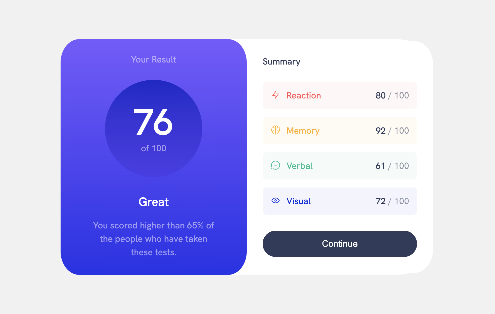

# Frontend Mentor - Results summary component solution

This is a solution to the [Results summary component challenge on Frontend Mentor](https://www.frontendmentor.io/challenges/results-summary-component-CE_K6s0maV). Frontend Mentor challenges help you improve your coding skills by building realistic projects. 

## Table of contents

- [Frontend Mentor - Results summary component solution](#frontend-mentor---results-summary-component-solution)
  - [Table of contents](#table-of-contents)
  - [Overview](#overview)
    - [The challenge](#the-challenge)
    - [Screenshot](#screenshot)
    - [Links](#links)
  - [My process](#my-process)
    - [Built with](#built-with)
    - [What I learned](#what-i-learned)
    - [Continued development](#continued-development)
    - [Useful resources](#useful-resources)
  - [Author](#author)

## Overview

### The challenge

Users should be able to:

- View the optimal layout for the interface depending on their device's screen size
- See hover and focus states for all interactive elements on the page

### Screenshot



### Links

- Solution URL: [dzhango.github.io/results-summary-component-project](https://dzhango.github.io/results-summary-component-project/)

## My process

### Built with

- Semantic HTML5 markup
- CSS custom properties (<a href="https://cube.fyi/"> Cube CSS </a>)
- Flexbox
- Web Components

### What I learned

I dove deep into css and was able to learn lots of nuances in regards to layout, flexbox and cascade.

To see how you can add code snippets, see below:

```CSS
/* CSS code that I am proud of :) */

li:has(.reaction) {
    color: var(--primary-lightred);
    background-color: var(--background-lightred);
}
.flex-row {
    display: flex;
    flex-direction: row;
    justify-content: center;
    align-items: center;
    flex-flow: row wrap;
}
```
### Continued development

I would like to learn more about web components and utilizing the shadow-DOM with component styles. I want to also want to practice how to create routes in SPA applications. 

### Useful resources

- Kevin Powell on youtube is a gold mine!

## Author

- Dzhangir Bayandarov